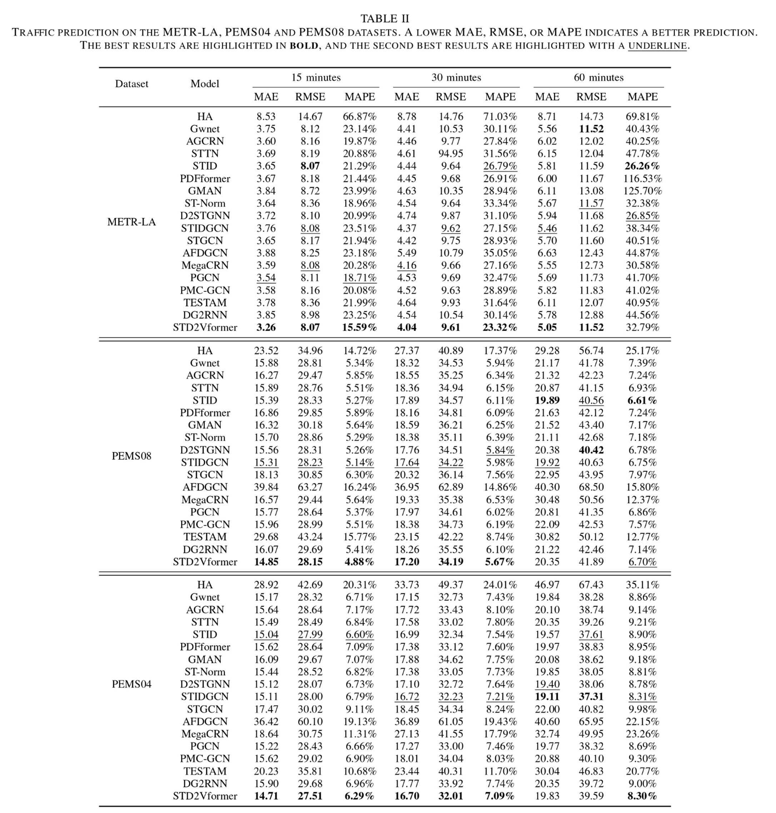
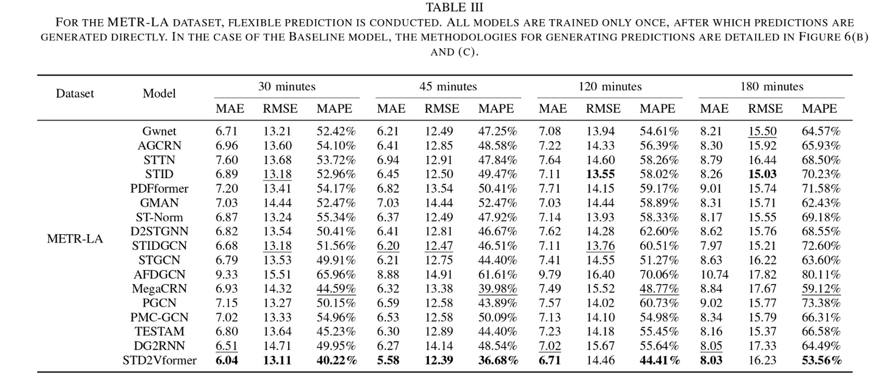
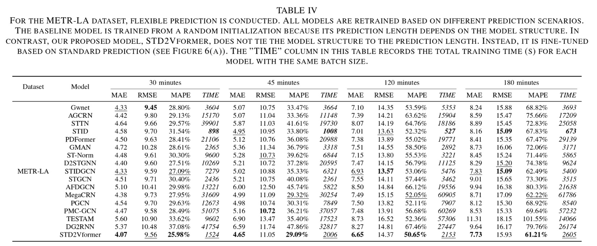

# STD2Vformer

A pytorch implementation for the paper: '*An Efficient and Flexible Spatiotemporal Prediction Model*‘

# 🎯Overview

	

<center><p>Figure1.The overall architecture of the proposed STD2Vformer</p></center>				


# 📊Regular Prediction



# 📊Flexible Prediction





# 📝Install dependecies

Install the required packages

```
pip install -r requirements.txt
```


# 👉Data Preparation

The Los Angeles traffic speed files (METR-LA), as well as the Los Angeles traffic flow files (PEMS04 and PEMS08), can be accessed and downloaded from [Baidu Yun](https://pan.baidu.com/s/1ShuACUFZGR0EnEkIoYSw-A?pwd=ib60). Please place these files in the `datasets/` folder.


# 🚀Run Experiment

We have provided all the experimental scripts for the benchmarks in the `./scripts` folder, which cover all the benchmarking experiments. To reproduce the results, you can run the following shell code.

```python
   ./scripts/train.sh
```


# 📧Contact

For any questions or feedback, feel free to contact 


# 🌟Citation

If you find this work is helpful to your research, please consider citing our paper:

```

```

**Thanks for your interest in our work!**


# 🤝Acknowledgments


