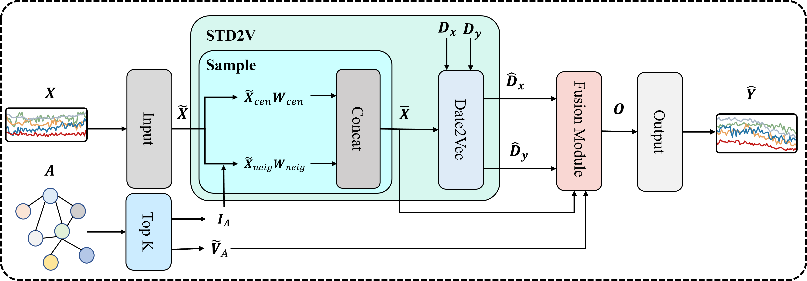
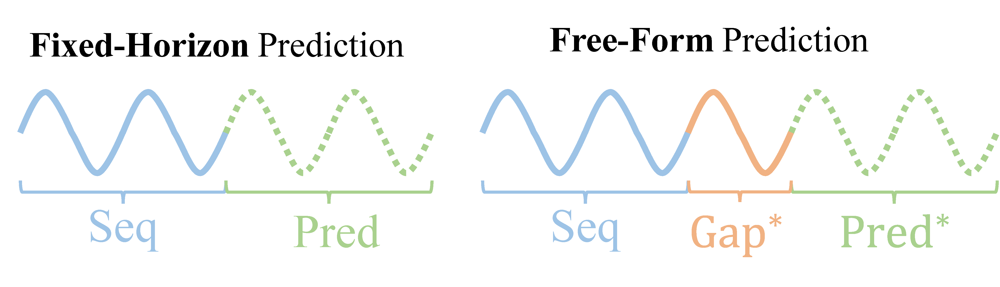

# STD2Vformer

[](https://www.python.org/downloads/release/python-390/) [](https://pytorch.org/) [](https://doi.org/10.1109/TII.2026.3655106) [](LICENSE)

This is the **Official PyTorch Implementation** for the paper:  
> **STD2Vformer: A Free-form Spatiotemporal Forecasting Model**  
> *IEEE Transactions on Industrial Informatics (TII), 2026*  
> Liwei Deng, Hao Wang<sup>&dagger;</sup>, Junhao Tan, Xinhe Niu, Yuxin He, Shiyao Zhang, and Zhihai He.

---


## 🎯 Overview

STD2Vformer is a novel architecture designed for **free-form spatiotemporal forecasting**. 

<div align="center">
  
  <br>
  <b>Figure 1.</b> The overall architecture of the proposed STD2Vformer.
</div>


Most existing models focus on **fixed-horizon prediction**, where the prediction starts immediately after the input with a fixed length. In contrast, **free-form prediction** (as illustrated in **Figure 2**) allows both the starting position (gap) and the length of the predicted sequence to be freely adjusted during training and inference.

<div align="center">
  
  <br>
  <b>Figure 2.</b> Comparison between fixed-horizon and free-form prediction. The <b>blue solid line</b> represents the input, the <b>green dashed line</b> is the prediction, and the <b>orange solid line</b> indicates the interval. <b>Left:</b> Fixed-horizon prediction (Gap=0, fixed length). <b>Right:</b> Free-form prediction where both gap and prediction length can vary freely.
</div>


## 🛠️ Installation

### 1. Environment Setup

We recommend using Anaconda to manage your environment.

```bash
# Create a virtual environment
conda create -n STD2Vformer python=3.9
conda activate STD2Vformer

# Install dependencies
pip install -r requirements.txt
```

## 📂 Data Preparation

We use the standard traffic forecasting datasets: **METR-LA**, **PEMS04**, **PEMS08**, and **PEMS-BAY**.

### Download Links
- **Baidu Netdisk**: [Link](https://pan.baidu.com/s/1ShuACUFZGR0EnEkIoYSw-A?pwd=ib60)
- **Google Drive**: [Link](https://drive.google.com/drive/folders/1lcv-QYH7nAk9ciGFOurSam6SJVWaW-lg?usp=sharing)

### Directory Structure
Please organize the downloaded files in the `datasets/` folder as follows:

```plain
STD2Vformer/
├── datasets/
│   ├── METR-LA/
│   ├── PEMS04/
│   ├── PEMS08/
│   └── PEMS-BAY/
├── scripts/
├── ...
```

## 🚀 Experiment

STD2Vformer currently supports three experiment modes.

### 📚 Experiment Modes

| Mode | Script | Description |
| --- | --- | --- |
| Fixed-Horizon Prediction | `scripts/fixed-horizon_prediction.sh` | Standard fixed-horizon forecasting |
| Free-Form No Retrain | `scripts/free-form_no_retrain.sh` | Train once and evaluate multiple horizons directly |
| Free-Form Retrain | `scripts/free-form_retrain.sh` | Pretrain first, then finetune for each target horizon |

### ⚡ Quick Start

Run one of the following scripts depending on the experiment setting you want.

#### 🧭 Fixed-Horizon Prediction

```bash
chmod 776 ./scripts/fixed-horizon_prediction.sh
./scripts/fixed-horizon_prediction.sh
```

#### 🪄 Free-Form Without Retraining

```bash
chmod 776 ./scripts/free-form_no_retrain.sh
./scripts/free-form_no_retrain.sh
```

#### 🔄 Free-Form With Retraining

```bash
chmod 776 ./scripts/free-form_retrain.sh
./scripts/free-form_retrain.sh
```

### 🧠 Non-Blind Setting (`w/NB`)

In the paper, `w/NB` denotes **with Non-Blind meta-information**.

In this repository, that setting is controlled by:

```bash
--is_no_blind True
```

The corresponding relation is:

- `w/NB`  ↔  `is_no_blind=True`
- `w/o NB` ↔ `is_no_blind=False`

> 💡 Note
> 
> The provided free-form scripts currently use `--is_no_blind False` by default.
> If you want to reproduce the `w/NB` setting, change it to `True` in the script,
> or pass `--is_no_blind True` manually when running `main.py`.

### ⚙️ Common Free-Form Arguments

| Argument | Meaning |
| --- | --- |
| `--flexible` | Enable free-form prediction |
| `--retrain` | Enable per-horizon retraining |
| `--pred_len` | Prediction horizon used during training |
| `--pred_len_test` | Evaluation horizons for free-form prediction |
| `--alpha` | Random horizon-shortening probability during training |
| `--is_no_blind` | Whether to use Non-Blind meta-information |

## 🌟 Citation

If you find this work helpful to your research, please consider citing our paper:

```bibtex
@ARTICLE{Deng2026,
  author={Deng, Liwei and Wang, Hao and Tan, Junhao and Niu, Xinhe and He, Yuxin and Zhang, Shiyao and He, Zhihai},
  journal={IEEE Transactions on Industrial Informatics}, 
  title={STD2Vformer: A Free-Form Spatiotemporal Forecasting Model}, 
  year={2026},
  pages={1-12},
  doi={10.1109/TII.2026.3655106}
}
```

## 🤝 Acknowledgements

We appreciate the following github repositories for their valuable code references:
- [Spatial-Temporal-Forecasting-Library](https://github.com/TCCofWANG/Spatial-Temporal-Forecasting-Library)
- [THML-Time-Series-Library](https://github.com/thuml/Time-Series-Library)
- [Time-Series-Library](https://github.com/TCCofWANG/Deep-Learning-based-Time-Series-Forecasting)
