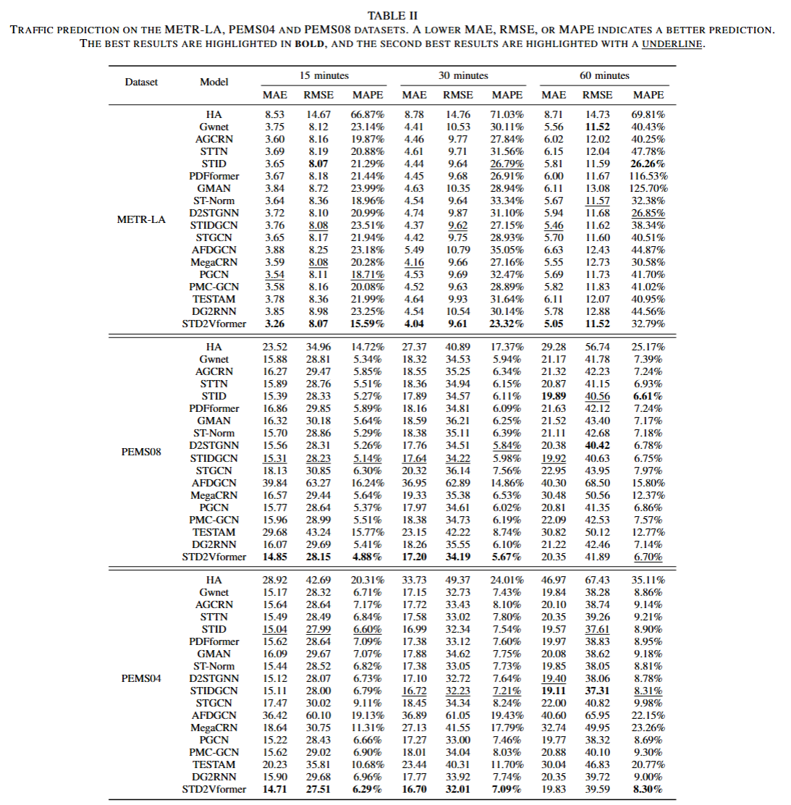

# STD2Vformer

A pytorch implementation for the paper: '*An Efficient and Flexible Spatiotemporal Prediction Model*‘

# 🎯Overview

	

<center><p>Figure1.The overall architecture of the proposed STD2Vformer</p></center>				


# 📊Regular Prediction



# 📊Flexible Prediction


# 📝Install dependecies

Install the required packages

```
pip install -r requirements.txt
```


# 👉Data Preparation

The Los Angeles traffic speed files (METR-LA), as well as the Los Angeles traffic flow files (PEMS04 and PEMS08), can be accessed and downloaded from [Baidu Yun](https://pan.baidu.com/s/1ShuACUFZGR0EnEkIoYSw-A?pwd=ib60) or [Google Drive](https://drive.google.com/drive/folders/1lcv-QYH7nAk9ciGFOurSam6SJVWaW-lg?usp=sharing). Please place these files in the `datasets/` folder.


# 🚀Run Experiment

We have provided all the experimental scripts for the benchmarks in the `./scripts` folder, which cover all the benchmarking experiments. To reproduce the results, you can run the following shell code.

```python
   ./scripts/train.sh
```


# 📧Contact

For any questions or feedback, feel free to contact [Liwei Deng](mailto:liweidengdavid@gmail.com).


# 🌟Citation

If you find this work is helpful to your research, please consider citing our paper:

```
Comming Soon!
```

**Thanks for your interest in our work!**


# 🤝Acknowledgments

We express our gratitude to the following members for their contributions to the project, completed under the guidance of Professor [Hao Wang](https://tccofwang.github.io/index.html):

 [Liwei Deng](https://liweidengdavid.github.io/), [Junhao Tan](http://paradise2200.github.io), [Xinhe Niu](https://xinheniu.github.io/)

